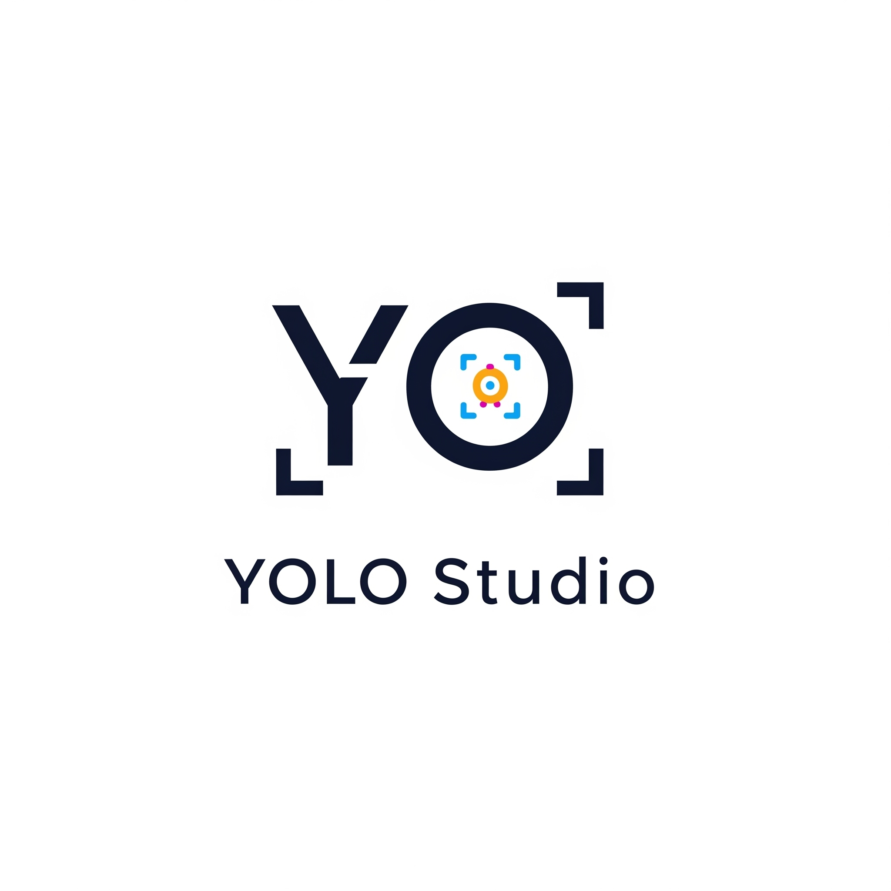
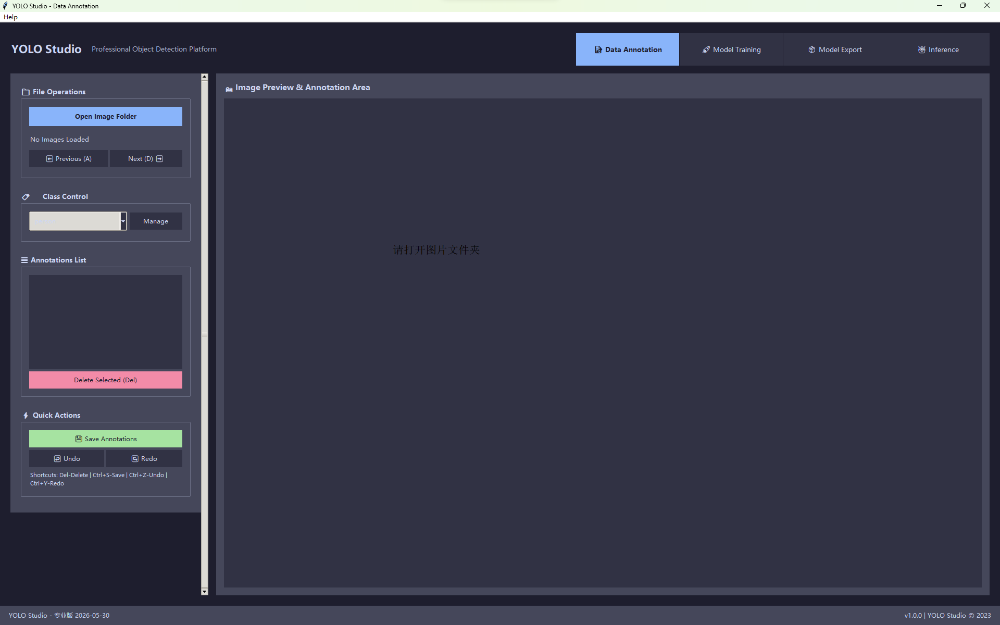
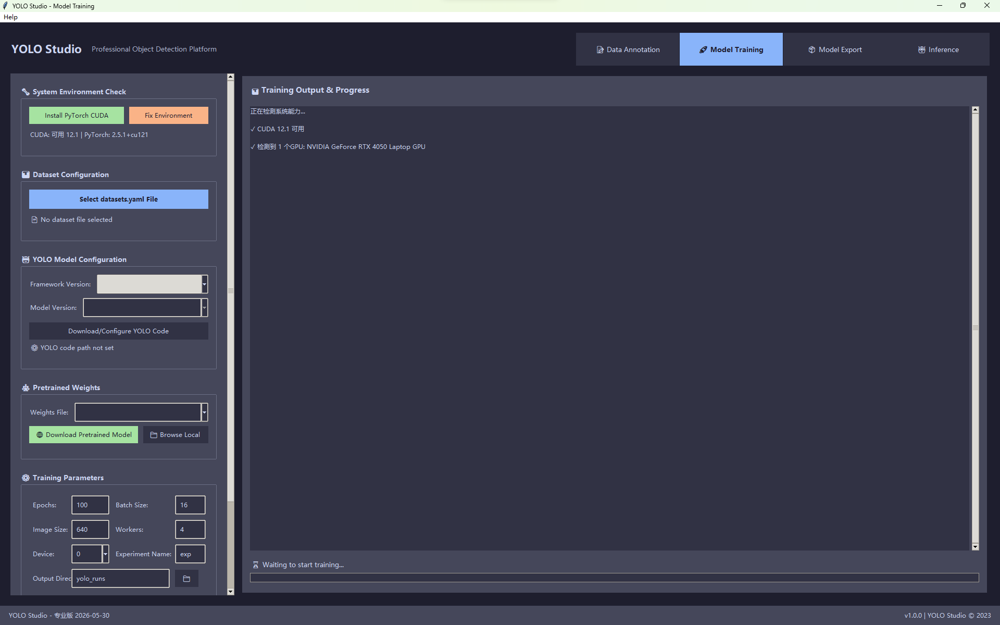
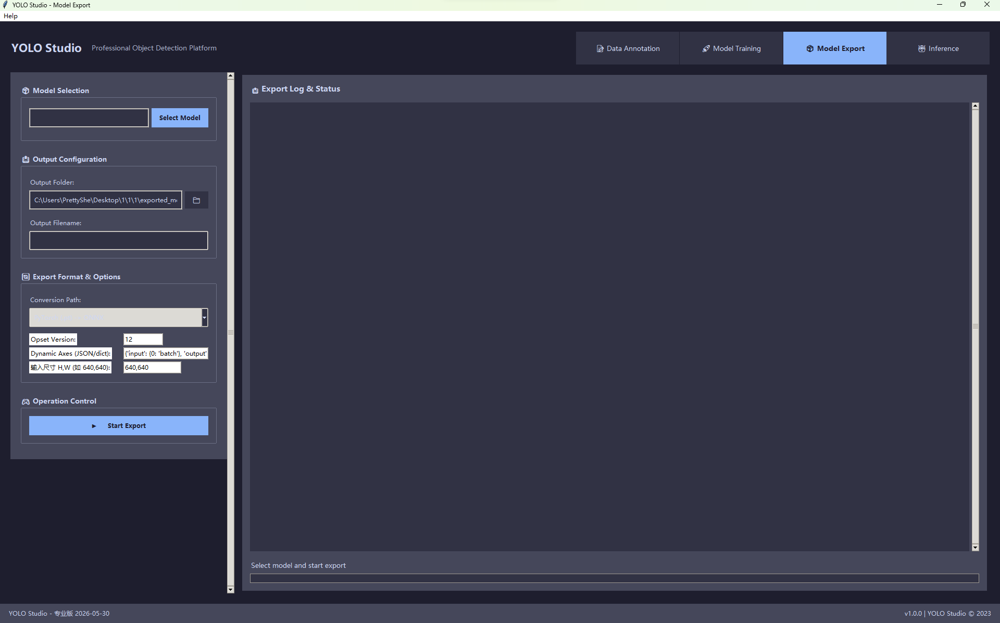
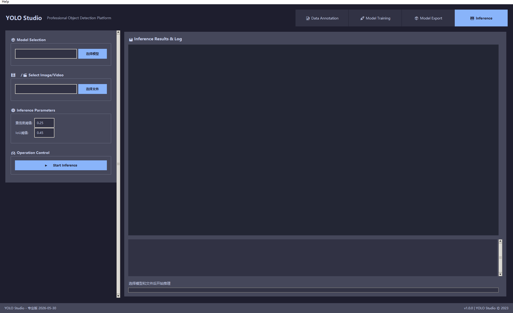

# YOLO Studio

<div align="center">
    <p>
        <b>English</b> | <a href="README_CN.md">简体中文</a>
    </p>
    
    <br>
    <h3>All-in-One YOLO Model Training, Annotation and Deployment Tool</h3>
    <p>
        
        
        
        
    </p>
</div>

## ✨ Project Overview

YOLO Studio is a powerful desktop application that integrates the complete workflow for object detection models, including data annotation, model training, and model export/deployment. It supports mainstream algorithms such as YOLOv5 and YOLOv8. With its intuitive user interface, you can complete the entire process from annotation to deployment without programming knowledge. Whether you're a computer vision researcher, machine learning engineer, or developer looking to integrate AI into your products, YOLO Studio is your ideal tool.

## 🚀 Key Features

- **Multi-functional Annotation Tool**: Intuitive graphical interface for rectangular, polygon, and other annotation operations
- **Compatible with Multiple YOLO Versions**: Supports training with YOLOv5, YOLOv8, and other mainstream algorithms
- **One-Click Training**: Simplified model training process with built-in parameter optimization recommendations
- **Flexible Export Formats**: Support for ONNX, TensorRT, OpenVINO, and other inference frameworks
- **Cross-Platform Support**: Compatible with Windows, Linux, and macOS
- **Clean Interface Design**: User-friendly workflow designed for non-technical users
- **Built-in Inference Function**: Test model effectiveness immediately after training
- **Batch Operation Support**: Efficiently process large datasets

## 📸 Interface Preview - Professional Version

<div align="center">
    
    
    <br><br>
    
    
</div>

## 🔧 Quick Start

### Requirements
- Python 3.7+
- CUDA (optional, for GPU training)

### Installation Steps

```bash
# Clone the repository
git clone https://github.com/PrettyMyGirlZyy4Embedded/yolo-studio.git
cd yolo-studio

# Install dependencies
pip install -r requirements.txt

# Launch the application
python main.py
```

The program will automatically check and install necessary dependencies.

### Language Settings

YOLO Studio supports multiple languages:

1. After launching the app, click "Help" > "Language Settings" in the top menu bar
2. Select your preferred language in the dialog
3. Click the "Apply" button
4. Some UI elements (like menus) will update immediately
5. **Important:** To fully switch the interface language, you need to restart the application

Currently supported languages:
- Simplified Chinese (Default)
- English

## 📚 Module Details

### 1. Data Annotation Module

- Supports annotation shapes: rectangles
- Convenient image navigation and zoom functions
- Automatic saving and restoration of annotation progress
- Shortcut key support to improve annotation efficiency
- Annotation data statistics and visualization

### 2. Model Training Module

- Integrated YOLOv5/YOLOv8 code repositories
- Visual training parameter configuration
- Real-time training progress and loss curve display
- Automatic evaluation of training results
- Checkpoint resumption support
- Pre-trained model selection

### 3. Model Export Module

- Multiple export formats: ONNX, TensorRT, TFLite, OpenVINO, etc.
- Model quantization options: INT8/FP16 precision
- Visual export parameter configuration
- Automatic verification of exported model correctness

### 4. Inference Testing Module

- Image and video inference support
- Batch inference capability
- Inference result visualization
- Performance metrics evaluation

## 🛠️ Version Comparison

| Feature | Open Source Version | Professional Version |
|---------|---------------------|----------------------|
| Data Annotation | ✅ Rectangle annotation | ✅ All shapes annotation |
| Model Training | ✅ Basic training | ✅ Advanced training parameters |
| Model Export | ❌ | ✅ Multiple format export |
| Inference Testing | ❌ | ✅ |
| Annotation Limit | 100 images | Unlimited |
| Training Parameter Limit | Basic parameters | All parameters |
| Class Count Limit | 10 classes | Unlimited |

## 🤝 How to Contribute

We welcome community contributions! Whether it's feature improvements, bug fixes, or documentation improvements, we appreciate all help.

1. Fork this repository
2. Create a feature branch (`git checkout -b feature/amazing-feature`)
3. Commit your changes (`git commit -m 'Add some amazing feature'`)
4. Push to the branch (`git push origin feature/amazing-feature`)
5. Create a Pull Request

## 📄 License

This project is licensed under the MIT License. See the [LICENSE](LICENSE) file for details.

## 🙏 Acknowledgments

- [Ultralytics](https://github.com/ultralytics/yolov5) - YOLOv5 creator
- [ONNX](https://github.com/onnx/onnx) - Open Neural Network Exchange format
- [OpenCV](https://github.com/opencv/opencv) - Computer Vision library

## 📬 Contact

- For project issues, please use [GitHub Issues](https://github.com/PrettyMyGirlZyy4Embedded/yolo-studio/issues)
- For business cooperation or to obtain the professional version and license, please contact: its.jianghe@gmail.com

---

<div align="center">
    <strong>YOLO Studio - Making AI Object Detection Simple</strong>
    <br>
    <sub>If this project helps you, please give it a ⭐️</sub>
</div> 