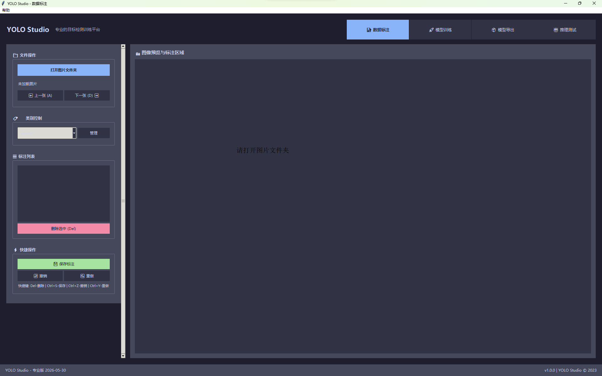
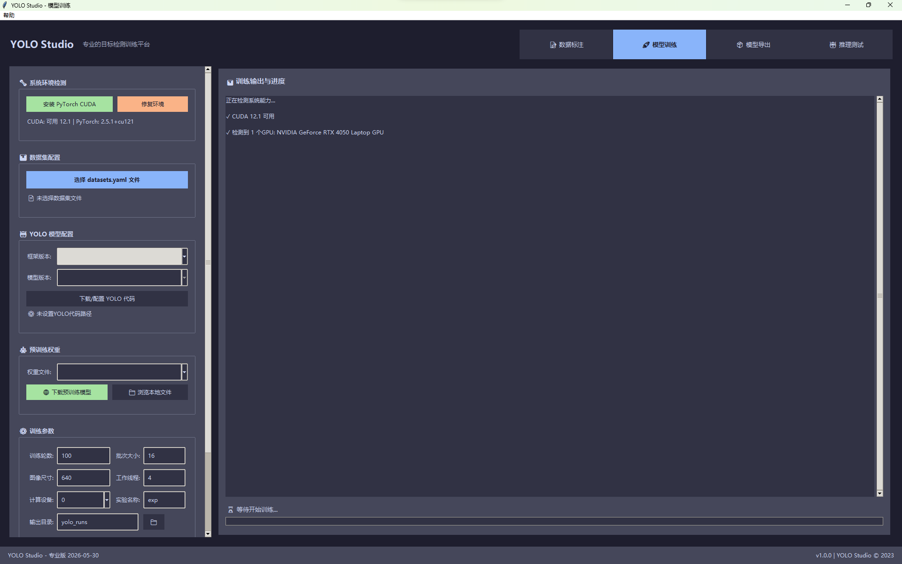
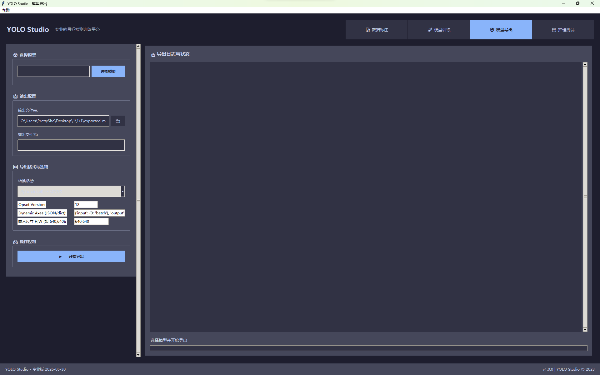
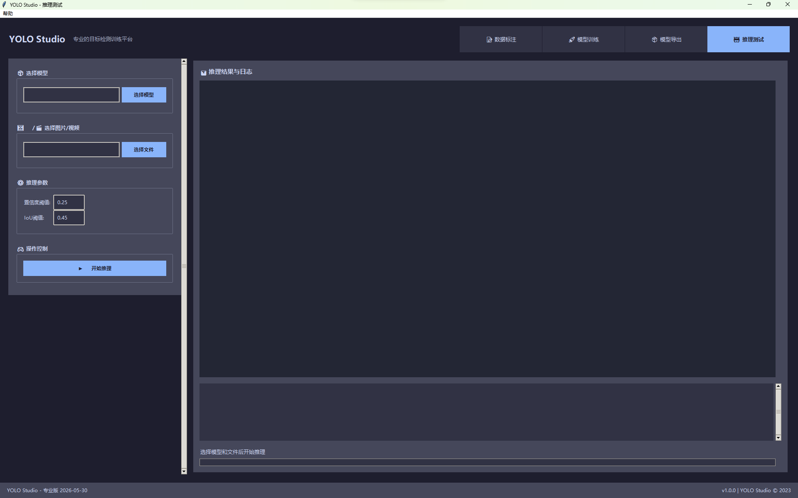

# YOLO Studio

<div align="center">
    <p>
        <a href="README.md">English</a> | <b>简体中文</b>
    </p>
    
    <br>
    <h3>一站式YOLO模型训练、标注与部署工具</h3>
    <p>
        
        
        
        
    </p>
</div>

## ✨ 项目简介

YOLO Studio 是一个功能强大的桌面应用，集成了目标检测模型的全流程操作，包括数据标注、模型训练和模型导出部署，支持主流的YOLOv5、YOLOv8等算法。它具有直观的用户界面，无需编程知识即可完成从标注到部署的全过程。无论您是计算机视觉研究者、机器学习工程师，还是希望将AI融入产品的开发者，YOLO Studio都是您的理想工具。

## 🚀 核心特性

- **多功能标注工具**：直观的图形界面进行矩形、多边形等标注操作
- **兼容多种YOLO版本**：支持YOLOv5、YOLOv8等主流算法训练
- **一键式训练**：简化模型训练流程，内置参数优化推荐
- **灵活导出格式**：支持ONNX、TensorRT、OpenVINO等多种推理框架
- **跨平台支持**：Windows、Linux、MacOS系统通用
- **简洁界面设计**：专为非技术用户设计的友好操作流程
- **内置推理功能**：训练完成后直接进行模型效果测试
- **批量操作支持**：高效处理大规模数据集

## 📸 界面预览-专业版

<div align="center">
    
    
    <br><br>
    
    
</div>

## 🔧 快速开始

### 环境要求
- Python 3.7+
- CUDA (可选，用于GPU训练)

### 安装步骤

```bash
# 克隆仓库
git clone https://github.com/PrettyMyGirlZyy4Embedded/yolo-studio.git
cd yolo-studio

# 安装依赖
pip install -r requirements.txt

# 启动应用
python main.py
```

程序会自动检查和安装必要的依赖项。

### 语言设置

YOLO Studio 支持多语言界面：

1. 启动应用后，点击顶部菜单栏中的"帮助" > "语言设置"
2. 在弹出的对话框中选择您希望使用的语言
3. 点击"应用"按钮
4. 部分界面元素（如菜单）会立即更新
5. **重要：** 要完全切换界面语言，您需要重启应用程序

目前支持的语言：
- 简体中文（默认）
- 英文

## 📚 功能模块详解

### 1. 数据标注模块

- 支持标注形状：矩形
- 便捷的图像导航和缩放功能
- 自动保存和恢复标注进度
- 快捷键支持提高标注效率
- 标注数据统计与可视化

### 2. 模型训练模块

- 内置YOLOv5/YOLOv8代码库集成
- 可视化训练参数配置
- 实时训练进度和损失曲线显示
- 训练结果自动评估
- 断点续训支持
- 预训练模型选择

### 3. 模型导出模块

- 多格式导出：ONNX、TensorRT、TFLite、OpenVINO等
- 模型量化选项：INT8/FP16精度
- 导出参数可视化配置
- 自动验证导出模型正确性

### 4. 推理测试模块

- 图像和视频推理支持
- 批量推理能力
- 推理结果可视化
- 性能指标评估

## 🛠️ 版本对比

| 功能 | 开源版 | 专业版 |
|------|--------|--------|
| 数据标注 | ✅ 矩形标注 | ✅ 全部形状标注 |
| 模型训练 | ✅ 基础训练 | ✅ 高级训练参数 |
| 模型导出 | ❌ | ✅ 多格式导出 |
| 推理测试 | ❌ | ✅ |
| 标注数量限制 | 100张图片 | 无限制 |
| 训练参数限制 | 基础参数 | 全部参数 |
| 类别数量限制 | 10个类别 | 无限制 |

## 🤝 如何贡献

我们非常欢迎社区贡献！无论是功能改进、Bug修复还是文档完善都非常感谢。

1. Fork本仓库
2. 创建特性分支 (`git checkout -b feature/amazing-feature`)
3. 提交更改 (`git commit -m 'Add some amazing feature'`)
4. 推送到分支 (`git push origin feature/amazing-feature`)
5. 创建Pull Request

## 📄 开源协议

本项目采用 Apache-2.0 许可证。详见 [LICENSE](LICENSE) 文件。

## 🙏 鸣谢

- [Ultralytics](https://github.com/ultralytics/yolov5) - YOLOv5原作者
- [ONNX](https://github.com/onnx/onnx) - 开放神经网络交换格式
- [OpenCV](https://github.com/opencv/opencv) - 计算机视觉库

## 📬 联系方式

- 项目问题请使用 [GitHub Issues](https://github.com/PrettyMyGirlZyy4Embedded/yolo-studio/issues)
- 商业合作或者获得专业版应用和许可证请联系: its.jianghe@gmail.com

---

<div align="center">
    <strong>YOLO Studio - 让AI目标检测变得简单</strong>
    <br>
    <sub>如果这个项目对您有帮助，请给它一个⭐️</sub>
</div> 
